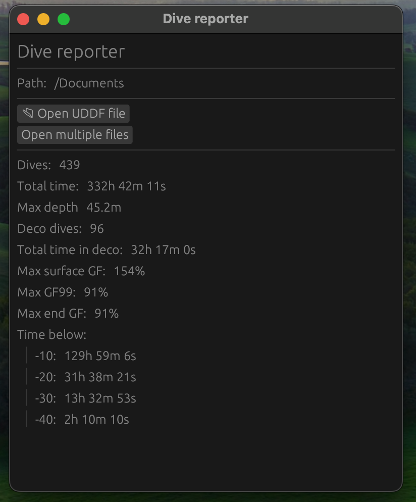
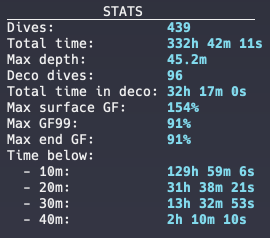

# DIVE-REPORTER

(Work in progress)

Analyse stats from .UDDF log files.
Uses [dive-deco](https://github.com/KG32/dive-deco) - Buehlmann ZHL-16C algorithm with GF 30/70

#### UI:
{height=300}

#### Console:
{height=200}
